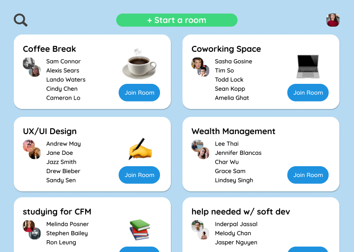
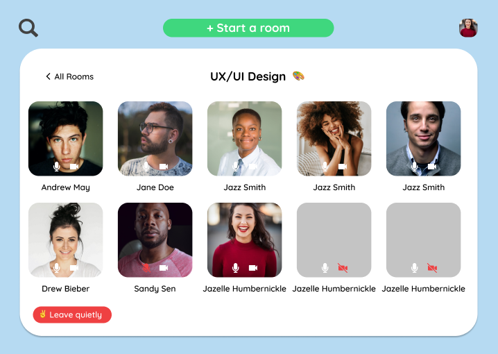

# Kangaroo (deCode Hackathon 2021)

Kangaroo is a communication app for modern companies. In Kangaroo you can spontaneously meet co-workers at your company. You can join the casual non-topic rooms like a coffee break and coworking space if you don't have anything in mind. You don't need to schedule anything. Don't make plans, just join a room!

## Our Process

I worked with the Mitel team in the 2021 deCode Hackathon. This was my first experience working as a team in web development. Our team split up into front end, back end, and design. I worked as a front end dev. I want to thank my great mentors at Mitel.

## ❔ Questions:

For questions about this project you can go to my GitHub page at the following link:

- [GitHub Profile](https://github.com/Halvosaurus34)

For additional questions please reach out to me at: lhalvorson34@gmail.com.

---

## 🎯 Links

[Kangaroo GitHub Repository](https://github.com/Halvosaurus34/kangaroo)

---

We used [Express](https://www.npmjs.com/package/express), [firebase](https://firebase.google.com/), [react](https://reactjs.org/), [twilio](https://www.twilio.com/), and [Material-UI](https://material-ui.com/) to build this web app.

---
